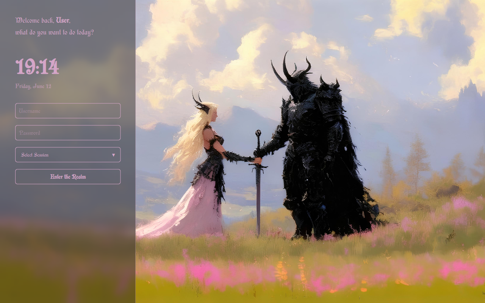

# After-the-Waltz SDDM Theme 🌸⚔️

Language: [English](README.md) | [Русский](README_RU.md)


A beautiful, sleek, and minimalist **Light/Dark Fantasy** login theme for SDDM. It features a modern layout, customized session chooser, responsive styling, and a stunning glassmorphic (blurred) left panel that adapts perfectly to your choice of artwork.

Designed to feel like entering a mystical RPG realm every time you boot up your Linux system.

---

## ✨ Features

- 🎭 **Light/Dark Fantasy Aesthetic:** Seamless blend of rich dark armor accents and soft mystical tones.
- 🧪 **Pure QML Glassmorphism:** A custom-built blur panel that opens up your background wallpaper.
- 🎛️ **No Broken Popups:** Fully customized, zero-bug dropdown menu for choosing your Desktop Environments or Window Managers (Hyprland, Plasma, Sway, etc.).
- 🖋️ **Custom Font Support:** Embedded `Preciosa` fantasy typography across all text fields.
- 🕒 **Dynamic Clock:** Real-time localized time and date indicator tracking system uptime.
- 👤 **Smart Username Detection:** Automatically remembers the last logged-in user.

---

## 📸 Preview


---

## 📂 Installation

### 1. Manual Installation

Clone this repository or download the ZIP archive and extract it directly into your system's SDDM themes directory:

```bash
# Clone the repository
git clone https://github.com

# Move the theme directory to system SDDM themes folder
sudo cp -r after-the-waltz /usr/share/sddm/themes/after-the-waltz
```

### 2. Enable the Theme

Edit your system's SDDM configuration file (usually found at `/etc/sddm.conf` or `/etc/sddm.conf.d/kde_settings.conf`). Set the current theme under the `[Theme]` section:

```ini
[Theme]
Current=after-the-waltz
```

---

## ⚙️ Configuration

You can easily tweak colors, fonts, and backgrounds by editing the `theme.conf` file inside the theme directory:

```ini
[General]
# Color palette in HEX format
ColorLight="#F4E8F1"
ColorDark="#1A1A1A"
ColorAccent="#D4A5C7"

# Font configurations
Font="Preciosa"
FontSize="20"

# Path to your background image
Background="backgrounds/background.jpg"
```

---

## 🛠️ Testing Without Reboot

You can preview and test how the theme looks live on your screen without logging out by running the following command in your terminal:

```bash
sddm-greeter --test-mode --theme /usr/share/sddm/themes/after-the-waltz
```

---

## 📜 Dependencies

Ensure your Linux distribution has the required graphical effects layer installed for the blur to work:
- For **Qt5-based SDDM**: `qt5-graphicaleffects`
- For **Qt6-based SDDM**: `qt6-5compat`